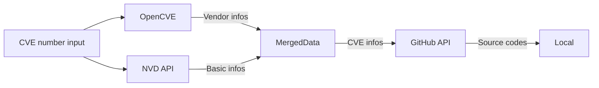

# VulnCodeCollector

A lightweight tool designed to automatically crawl CVE-related source code, with the capability to export content in a readable database format(i.e. 多维表格) for applications like Lark or Tencent Docs.

## Description

通过nvd的API接口和GitHub的API，自动化获取给出的CVE漏洞的相关信息和源代码文件。



获取的文件包括：

- [x] 漏洞的信息描述(.json)
- [x] GitHub提供的patch前/后文件+.diff
- [ ] 可以导入Lark或者腾讯文档的.csv文件

## Install

### Install dependencies

```shell
conda env create -f environment.yaml
conda activate vulnsrc
```

### Get NVD API key

>[!tip]
> 关于NVD API更多信息，参阅[Official Doc](https://nvd.nist.gov/developers/start-here)

参考#4，NVD数据库对于无key的匿名访问限制每30秒最多5次，而使用API可以在30秒内访问50次。在该[链接](https://nvd.nist.gov/developers/request-an-api-key)处请求一个API key，并执行下面的命令注册到本机上：

```shell
python3 main.py register nvd [yourKey]
```

> [!caution]
> 本项目暂时明文存储token在`.env`，因此需要确保本地运行环境安全可信，以避免不必要的token泄漏。未来可能用某种方法加密存储credentials。
>

### Get GitHub Token

> [!tip]
> 关于GitHub提供的API更多信息，请参阅[Official Doc](https://docs.github.com/zh/rest?apiVersion=2022-11-28)。本项目的GitHub REST API基于当前最新的版本`2022-11-28`

GitHub的API需要提供[Personal Access Token](https://docs.github.com/zh/rest/authentication/authenticating-to-the-rest-api?apiVersion=2022-11-28)进行验证。请参考[Official Doc](https://docs.github.com/zh/authentication/keeping-your-account-and-data-secure/managing-your-personal-access-tokens#创建-personal-access-token-classic)生成个人使用的PAT以使用GitHub API。在token的作用域选择上，为保证token的最小权限，不需要选择任何额外的权限，因为本项目只访问公开的repo。

在获取到PAT后，运行下面的指令注册token到本机的环境变量中。Token将保存在`.env`中。

```shell
python3 main.py register github [yourPAT]
```

> [!caution]
> 本项目暂时明文存储token在`.env`，因此需要确保本地运行环境安全可信，以避免不必要的token泄漏。未来可能用某种方法加密存储credentials。

### Get OpenCVE Account

> [!tip]
> 关于OpenCVE提供的API更多信息，请参阅[Official Doc](https://docs.opencve.io/api/)

[OpenCVE](https://www.opencve.io/)的API需要通过基于用户名和密码的基本认证。OpenCVE为注册的免费用户提供1000qph的rate limit。在[Official register URL](https://app.opencve.io/signup/)注册账号，并通过类似的方法注册用户名和密码到本机的环境变量中。

```shell
python3 main.py register opencve [username] [password]
```

> [!caution]
> 本项目暂时明文存储账户和密码在`.env`，因此需要确保本地运行环境安全可信，建议使用随机生成的密码和不重要的用户名。

## Usage

```shell
TBD
```

## TODO

- [x] 添加对OpenCVE的API支持
- [ ] 添加对Linux kernel git的支持 (issue #2)
- [ ] 导出数据为兼容腾讯文档/飞书格式的csv文件方便阅览和共享
- [ ] 调用大模型对commit进行分析，确定出现漏洞的文件
