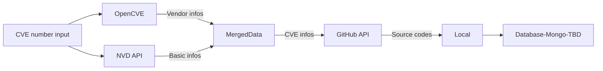

# VulnCodeCollector

A lightweight tool designed to automatically crawl CVE-related source code, with the capability to export content in a readable database format(i.e. 多维表格) for applications like Lark or Tencent Docs.

## Description

通过nvd的API接口和GitHub的API，自动化获取给出的CVE漏洞的相关信息和源代码文件。



获取的文件暂时可能包括：

- [ ] 漏洞的信息描述(.json)
- [ ] GitHub提供的patch前/后文件+.diff
- [ ] 可以导入Lark或者腾讯文档的.csv文件

## Install

### Install dependencies

```shell
conda env create -f environment.yaml
conda activate vulnsrc
```

### GitHub Auth

> [!tip]
> GitHub REST API存在用量限制，可以通过认证访问令牌获取更多的请求速率。参见[Official doc](https://docs.github.com/zh/rest/using-the-rest-api/rate-limits-for-the-rest-api?apiVersion=2022-11-28)

GitHub的REST API仅支持通过personal access token进行认证。（[参考](https://docs.github.com/zh/rest/authentication/authenticating-to-the-rest-api?apiVersion=2022-11-28#authenticating-with-username-and-password)）

参考[Official doc](https://docs.github.com/zh/rest/quickstart?apiVersion=2022-11-28)可以获取更多信息。

[获取与使用personal access token](https://docs.github.com/zh/authentication/keeping-your-account-and-data-secure/managing-your-personal-access-tokens#创建-personal-access-token-classic)

### OpenCVE Auth

[OpenCVE](https://www.opencve.io/)对免费用户提供60qph的API接口，应该足够使用了。

在[Official register URL](https://app.opencve.io/signup/)注册。注册获得用户名和密码后在程序初始化时注册信息，后续可以自动从文件中调取。方式如下：

```shell
main.py opencve reg [username] [password]
```

> [!warning]暂定明文存储用户名和密码在`.env`，因此需要确保运行环境安全可控，建议使用随机生成的密码和不重要的用户名。

## TODO

- [ ] OpenCVE的数据支持
- [ ] 针对Linux Kernel项目的CVE，从git.kernel.org拿信息而不是GitHub
